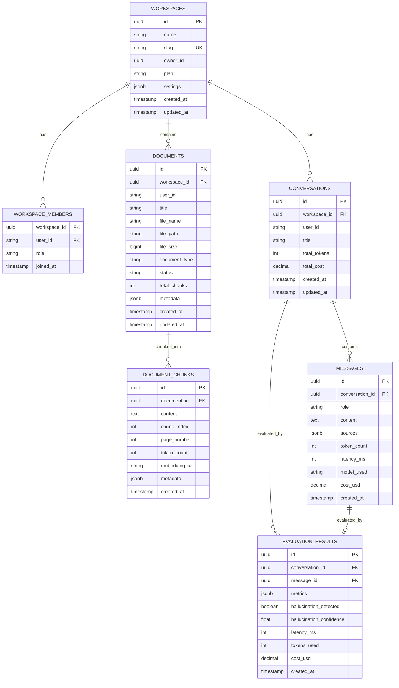

# Entity Relationship Diagram

```mermaid
erDiagram
    WORKSPACES {
        uuid id PK
        string name
        string slug UK
        uuid owner_id
        string plan
        jsonb settings
        timestamp created_at
        timestamp updated_at
    }
    WORKSPACE_MEMBERS {
        uuid workspace_id FK
        string user_id FK
        string role
        timestamp joined_at
    }
    DOCUMENTS {
        uuid id PK
        uuid workspace_id FK
        string user_id
        string title
        string file_name
        string file_path
        bigint file_size
        string document_type
        string status
        int total_chunks
        jsonb metadata
        timestamp created_at
        timestamp updated_at
    }
    DOCUMENT_CHUNKS {
        uuid id PK
        uuid document_id FK
        text content
        int chunk_index
        int page_number
        int token_count
        string embedding_id
        jsonb metadata
        timestamp created_at
    }
    CONVERSATIONS {
        uuid id PK
        uuid workspace_id FK
        string user_id
        string title
        int total_tokens
        decimal total_cost
        timestamp created_at
        timestamp updated_at
    }
    MESSAGES {
        uuid id PK
        uuid conversation_id FK
        string role
        text content
        jsonb sources
        int token_count
        int latency_ms
        string model_used
        decimal cost_usd
        timestamp created_at
    }
    EVALUATION_RESULTS {
        uuid id PK
        uuid conversation_id FK
        uuid message_id FK
        jsonb metrics
        boolean hallucination_detected
        float hallucination_confidence
        int latency_ms
        int tokens_used
        decimal cost_usd
        timestamp created_at
    }
    
    WORKSPACES ||--o{ WORKSPACE_MEMBERS : has
    WORKSPACES ||--o{ DOCUMENTS : contains
    WORKSPACES ||--o{ CONVERSATIONS : has
    DOCUMENTS ||--o{ DOCUMENT_CHUNKS : chunked_into
    CONVERSATIONS ||--o{ MESSAGES : contains
    CONVERSATIONS ||--o{ EVALUATION_RESULTS : evaluated_by
    MESSAGES ||--o| EVALUATION_RESULTS : evaluated_by
```
