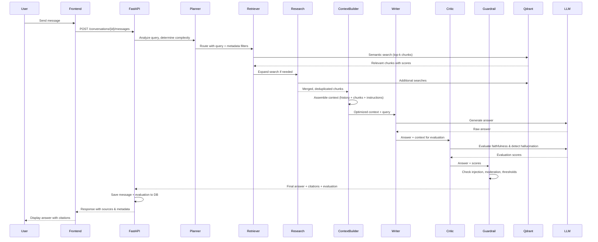
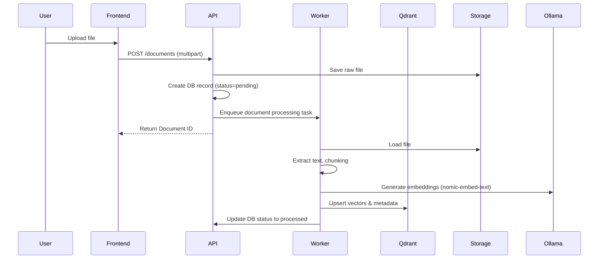
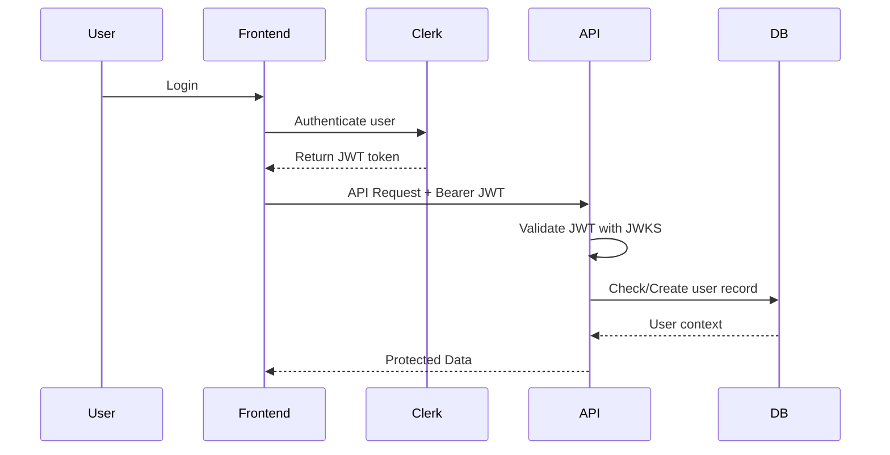

### RAG Pipeline Sequence

```mermaid
sequenceDiagram
    participant User
    participant Frontend
    participant FastAPI
    participant Planner
    participant Retriever
    participant Research
    participant ContextBuilder
    participant Writer
    participant Critic
    participant Guardrail
    participant Qdrant
    participant LLM
    
    User->>Frontend: Send message
    Frontend->>FastAPI: POST /conversations/{id}/messages
    FastAPI->>Planner: Analyze query, determine complexity
    Planner->>Retriever: Route with query + metadata filters
    Retriever->>Qdrant: Semantic search (top-k chunks)
    Qdrant-->>Retriever: Relevant chunks with scores
    Retriever->>Research: Expand search if needed
    Research->>Qdrant: Additional searches
    Research-->>ContextBuilder: Merged, deduplicated chunks
    ContextBuilder->>ContextBuilder: Assemble context (history + chunks + instructions)
    ContextBuilder->>Writer: Optimized context + query
    Writer->>LLM: Generate answer
    LLM-->>Writer: Raw answer
    Writer->>Critic: Answer + context for evaluation
    Critic->>LLM: Evaluate faithfulness & detect hallucination
    LLM-->>Critic: Evaluation scores
    Critic->>Guardrail: Answer + scores
    Guardrail->>Guardrail: Check injection, moderation, thresholds
    Guardrail-->>FastAPI: Final answer + citations + evaluation
    FastAPI->>FastAPI: Save message + evaluation to DB
    FastAPI-->>Frontend: Response with sources & metadata
    Frontend-->>User: Display answer with citations
```

### Document Upload Sequence

```mermaid
sequenceDiagram
    participant User
    participant Frontend
    participant API
    participant Worker
    participant Qdrant
    participant Storage
    
    User->>Frontend: Upload file
    Frontend->>API: POST /documents (multipart)
    API->>Storage: Save raw file
    API->>API: Create DB record (status=pending)
    API->>Worker: Enqueue document processing task
    API-->>Frontend: Return Document ID
    Worker->>Storage: Load file
    Worker->>Worker: Extract text, chunking
    Worker->>Ollama: Generate embeddings (nomic-embed-text)
    Worker->>Qdrant: Upsert vectors & metadata
    Worker->>API: Update DB status to processed
```

### Authentication Flow Sequence

```mermaid
sequenceDiagram
    participant User
    participant Frontend
    participant Clerk
    participant API
    participant DB
    
    User->>Frontend: Login
    Frontend->>Clerk: Authenticate user
    Clerk-->>Frontend: Return JWT token
    Frontend->>API: API Request + Bearer JWT
    API->>API: Validate JWT with JWKS
    API->>DB: Check/Create user record
    DB-->>API: User context
    API-->>Frontend: Protected Data
```
